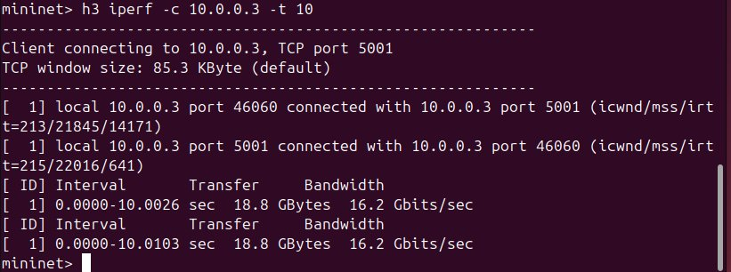
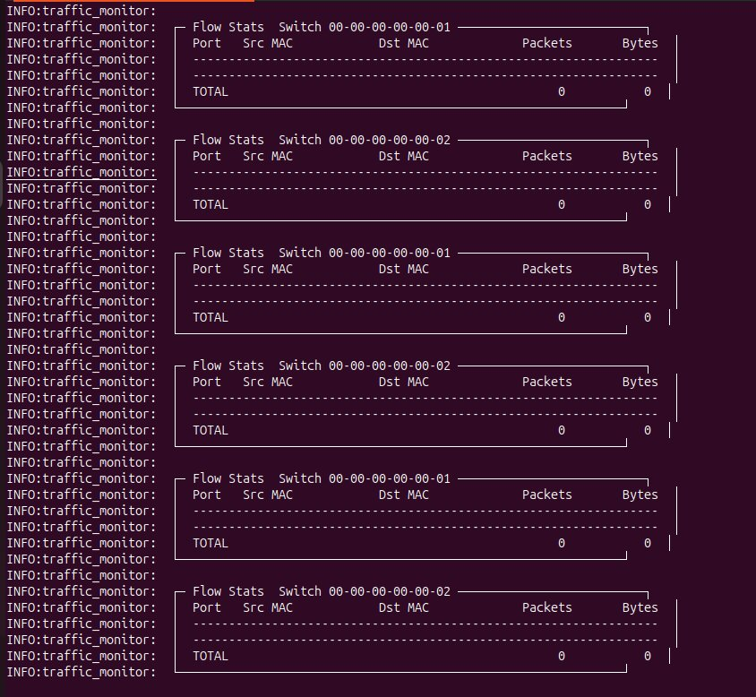
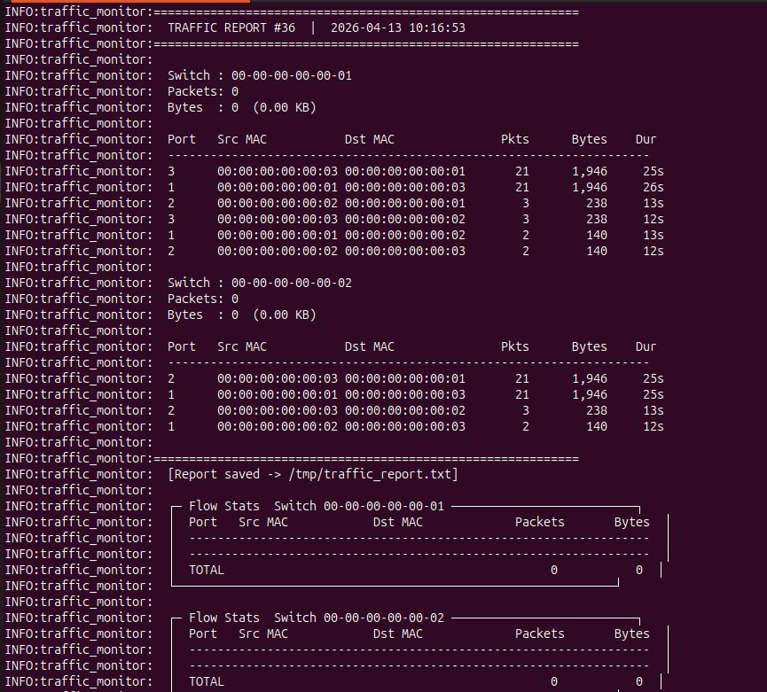
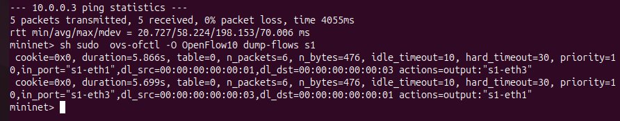
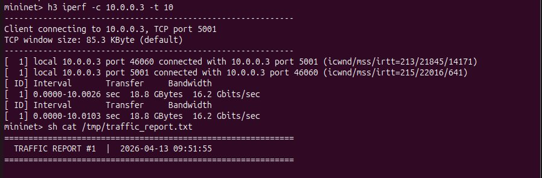
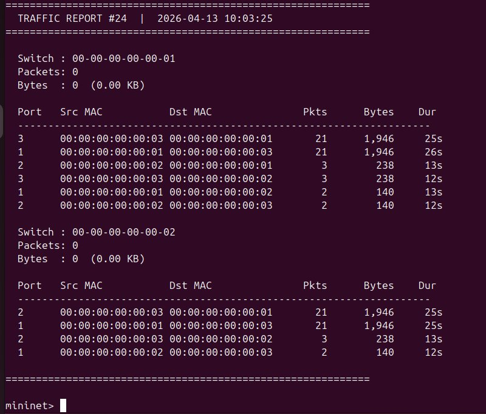

# Traffic Monitoring and Statistics Collector

## Problem Statement

Build an SDN controller module using **POX** and **Mininet** that:
- Retrieves OpenFlow flow statistics from switches
- Displays per-flow packet and byte counts
- Performs periodic monitoring at configurable intervals
- Generates simple summary reports saved to disk

---

## Topology

```
  h1 (10.0.0.1)
        |
       s1 ── s2 ── h3 (10.0.0.3)
        |
  h2 (10.0.0.2)
```

- 2 OVS switches (`s1`, `s2`) running OpenFlow 1.0
- 3 hosts (`h1`, `h2`, `h3`)
- 1 POX remote controller

---

## Files

| File | Purpose |
|------|---------|
| `traffic_monitor.py` | POX controller – learning switch + stats collection |
| `topology.py` | Mininet custom topology (2 switches, 3 hosts) |
| `test_scenarios.py` | Two test scenarios (ping flood + iperf TCP) |

---

## Setup & Execution

### Prerequisites

```bash
sudo apt install mininet git -y
cd ~
git clone https://github.com/noxrepo/pox.git
```

### Step 1 – Place controller file

```bash
cp traffic_monitor.py ~/pox/ext/
```

### Step 2 – Terminal 1: Start POX Controller

```bash
cd ~/pox
python3 pox.py log.level --DEBUG traffic_monitor
```

Expected output:
```
INFO:traffic_monitor:==================================================
INFO:traffic_monitor:  Traffic Monitor Controller started
INFO:traffic_monitor:  Stats every 5s | Report every 30s
INFO:traffic_monitor:==================================================
```

### Step 3 – Terminal 2: Start Mininet Topology

```bash
sudo python3 topology.py
```

### Step 4 – Fix OpenFlow version (Terminal 3, one time only)

```bash
sudo ovs-vsctl set bridge s1 protocols=OpenFlow10
sudo ovs-vsctl set bridge s2 protocols=OpenFlow10
```

Switches will now connect to POX. You will see in Terminal 1:
```
INFO:traffic_monitor:[Switch 00-00-00-00-00-01] connected
INFO:traffic_monitor:[Switch 00-00-00-00-00-02] connected
```

### Step 5 – Run Test Scenarios (Mininet CLI)

**Scenario 1 – Ping flood:**
```
mininet> h1 ping -c 20 h3
```

**Scenario 2 – iperf TCP stream:**
```
mininet> h3 iperf -s &
mininet> h1 iperf -c 10.0.0.3 -t 10
```

**Check flow table:**
```
mininet> h1 ping -c 5 h3
mininet> sh sudo ovs-ofctl -O OpenFlow10 dump-flows s1
```

**Read the report:**
```
mininet> sh cat /tmp/traffic_report.txt
```

---

## Expected Output

### Controller Terminal (every 5 seconds):

```
INFO:traffic_monitor:  ┌─ Flow Stats  Switch 00-00-00-00-00-01 ──────────────────┐
INFO:traffic_monitor:  │  Port   Src MAC            Dst MAC            Packets   Bytes  │
INFO:traffic_monitor:  │  1      00:00:00:00:00:01  00:00:00:00:00:03       21    1,946  │
INFO:traffic_monitor:  │  2      00:00:00:00:00:02  00:00:00:00:00:03        3      238  │
INFO:traffic_monitor:  │  TOTAL                                              24    2,184  │
INFO:traffic_monitor:  └────────────────────────────────────────────────────────────────┘
```

### Report File (`/tmp/traffic_report.txt`):

```
============================================================
  TRAFFIC REPORT #24  |  2026-04-13 10:03:25
============================================================

  Switch : 00-00-00-00-00-01
  Packets: 0
  Bytes  : 0  (0.00 KB)

  Port   Src MAC            Dst MAC              Pkts      Bytes   Dur
  ------------------------------------------------------------------------
  3      00:00:00:00:00:03  00:00:00:00:00:01      21      1,946   25s
  1      00:00:00:00:00:01  00:00:00:00:00:03      21      1,946   26s
  2      00:00:00:00:00:02  00:00:00:00:00:01       3        238   13s

  Switch : 00-00-00-00-00-02
  Packets: 0
  Bytes  : 0  (0.00 KB)

  Port   Src MAC            Dst MAC              Pkts      Bytes   Dur
  ------------------------------------------------------------------------
  2      00:00:00:00:00:03  00:00:00:00:00:01      21      1,946   25s
  1      00:00:00:00:00:01  00:00:00:00:00:03      21      1,946   25s
```

### OVS Flow Table (`dump-flows s1`):

```
cookie=0x0, duration=5.866s, table=0, n_packets=6, n_bytes=476,
idle_timeout=10, hard_timeout=30, priority=10,
in_port="s1-eth1",dl_src=00:00:00:00:00:01,dl_dst=00:00:00:00:00:03
actions=output:"s1-eth3"

cookie=0x0, duration=5.699s, table=0, n_packets=6, n_bytes=476,
idle_timeout=10, hard_timeout=30, priority=10,
in_port="s1-eth3",dl_src=00:00:00:00:00:03,dl_dst=00:00:00:00:00:01
actions=output:"s1-eth1"
```

---

## Test Scenarios & Results

### Scenario 1 – ICMP Ping Flood

**Command:**
```
mininet> h1 ping -c 20 h3
```

**Result:**
```
20 packets transmitted, 20 received, 0% packet loss, time 19063ms
rtt min/avg/max/mdev = 19.564/52.158/213.651/44.361 ms
```

**Observation:** Packet counts grow in flow stats every 5 seconds. ICMP flow entries visible in OVS flow table with match+action rules installed by controller.

---

### Scenario 2 – TCP iperf Stream

**Command:**
```
mininet> h3 iperf -s &
mininet> h1 iperf -c 10.0.0.3 -t 10
```

**Result:**
```
[ 1] 0.0000-10.0026 sec  18.8 GBytes  16.2 Gbits/sec
```

**Observation:** Byte counts jump significantly in flow stats. Controller installs TCP flow rules and collects byte-level statistics showing high throughput.

---

## SDN Concepts Demonstrated

| Concept | Implementation |
|---------|---------------|
| `packet_in` handling | `_handle_PacketIn()` in controller |
| Match + Action rules | `ofp_flow_mod` with `dl_src`, `dl_dst`, `in_port` |
| Flow rule installation | Priority=10, idle_timeout=10, hard_timeout=30 |
| Stats retrieval | `ofp_stats_request` → `_handle_FlowStatsReceived()` |
| Periodic monitoring | `Timer(5, ...)` and `Timer(30, ...)` background loops |
| Learning switch | MAC-to-port table updated on every `packet_in` |
| Report generation | Appends to `/tmp/traffic_report.txt` every 30s |

---

## References

- [POX Documentation](https://noxrepo.github.io/pox-doc/html/)
- [Mininet Walkthrough](http://mininet.org/walkthrough/)
- [OpenFlow 1.0 Spec](https://opennetworking.org/wp-content/uploads/2013/04/openflow-spec-v1.0.0.pdf)
- [POX Wiki](https://github.com/noxrepo/pox/wiki)

## Proof of Execution

### Scenario 1 – Ping Result (20 packets, 0% loss)


### POX Controller – Flow Stats Table


### POX Controller – Report in Terminal


### Scenario 2 – iperf TCP Stream Result


### OVS Flow Table (dump-flows s1)


### Traffic Report File (/tmp/traffic_report.txt)

